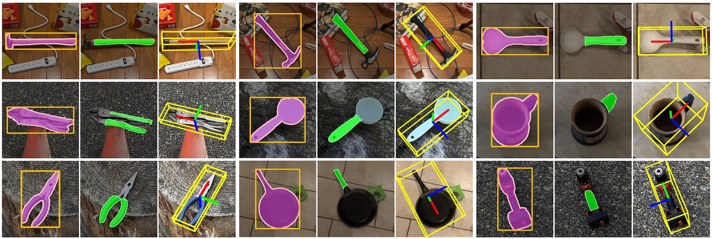

# HANDAL



## HANDAL Dataset

The HANDAL dataset is category-level dataset for object pose estimation and affordance prediction, with a focus on hardware and kitchen tool objects that are of the proper size and shape for functional robotic grasping (e.g. pliers, utensils, and screwdrivers). The dataset consists of 308k annotated image frames from 2.2k videos of 212 real-world objects in 17 categories.

Dataset is available for download from [Google Drive](https://drive.google.com/drive/folders/1ANTZAXDbZbszyxa7ZO9_DcFHe8tbdCIN?usp=drive_link). Dataset is released under [CC-BY-NC-SA-4.0 license](https://creativecommons.org/licenses/by-nc-sa/4.0/).

Dataset follows the [BOP format](https://github.com/thodan/bop_toolkit/blob/master/docs/bop_datasets_format.md), with some minor modifications:
- Image size is provided in `scene_camera.json` for each scene, since multiple camera sensors were used to capture data
- Depth is rendered from NeRF reconstructions of the scene ([Instant NGP](https://github.com/NVlabs/instant-ngp)) rather than from a depth sensor
- RGB images are compressed using JPEG rather than PNG

For more details, see the [project page](https://nvlabs.github.io/HANDAL) and our 2023 [IROS paper](https://arxiv.org/abs/2308.01477).


## HANDAL Toolkit

Our annotation process is streamlined, requiring only a single off-the-shelf camera and semi-automated processing, allowing us to produce high-quality 3D annotations without crowd-sourcing. This section covers how to install the HANDAL toolkit and use it to annotate static scenes.


### Setup 

Our toolkit requires an NVIDIA GPU capable of running [Instant-NGP](https://github.com/NVlabs/instant-ngp/blob/master/README.md#requirements). We have only tested the toolkit on Ubuntu.

#### Installing the HANDAL toolkit
We recommend installing the HANDAL pipeline in a separate Python environment, using Python 3.10 or greater.
```
conda create -n handal-toolkit python=3.10
git clone https://https://github.com/NVlabs/HANDAL.git
cd HANDAL
pip install -r requirements.txt 
```

#### Installing Instant-NGP
Our pipeline leverages the [Instant-NGP](https://github.com/NVlabs/instant-ngp) Python bindings for scene reconstruction, depth estimation, and mesh construction.
Follow the instructions to build [Instant-NGP](https://github.com/NVlabs/instant-ngp#building-instant-ngp-windows--linux) and its [Python bindings](https://github.com/NVlabs/instant-ngp#python-bindings).
Some potential headaches may be avoided by building the Python bindings in the same Python environment as the one used to install the HANDAL toolkit.
Finally, set the `CONFIG_NGP_PATH` variable in `configs/default_config.sh` to the root directory of the Instant-NGP repository.

The following commands worked for our local build of Instant-NGP. We share them in case they are helpful, but we recommend following the official instructions if any problems are encountered:
```
conda activate handal-toolkit
cd HANDAL
git clone --recursive https://github.com/nvlabs/instant-ngp submodules/instant-ngp
cd submodules/instant-ngp
conda install -c conda-forge libgcc-ng libstdcxx-ng cmake  # fix the missing GLIBCXX 3.4.30 error
pip install -r requirements.txt
cmake . -B build -DCMAKE_BUILD_TYPE=RelWithDebInfo
cmake --build build --config RelWithDebInfo -j
python ./scripts/run.py --help
```

#### Installing a video segmentation tool
To initialize the pipeline, we require rough segmentation masks of the object to be annotated. We recommend considering the video segmentation tool [Cutie](https://github.com/hkchengrex/Cutie), a follow-up work to [XMem](https://github.com/hkchengrex/XMem). To avoid conflicting with the other requirements, we recommend installing it in a separate Python environment.


### Running the example

To test the installation, download the example scenes from [Google Drive](https://drive.google.com/drive/folders/1znqQgfNfe5yoDd3SVy7JJfkAy4CXRTpy?usp=sharing) and extract them to `example/`. Object segmentation masks are already provided for these examples in the `input_masks/` directory.

#### Process reference scene
To generate the initial reconstruction and annotation of the reference scan, run the following command:
```
bash run.sh example/drill_reference
```
If the command runs successfully, you will find initial annotations and results in `example/drill_reference/`, including raw BOP annotations `bop_raw/scene_*_initial.json`, a mesh with vertex colors `meshes/colored.ply`, and rendered depth maps `depth_scene/`. The initial annotations lack ground truth scale because we use RGB-only inputs. The next steps will interactively place the reference object in a canonical pose and estimate the correct scale.

First, ensure that `example/drill_reference/config.sh` contains the following line to indicate that this is a reference scene:
```
CONFIG_IS_REFERENCE=1
```
Then, run the following command:
```
bash run.sh example/drill_reference --interactive
```
First, an interactive tool will place the object in a canonical pose. The canonical pose is automatically initialized using an oriented bounding cuboid fit to the object mesh.
Use the keys `r`, `g`, and `b` to rotate the object in 1 degree increments around the `x`, `y`, and `z` axes, respectively.
(The `shift` key can be used to rotate in the opposite direction, the `ctrl` key can be used to make 90 degree rotations, and the `alt` key can be used to make 0.1 degree rotations.)

Use the `v` key to cycle through canonical viewing directions (corresponding to the [BOP](https://github.com/thodan/bop_toolkit/blob/master/docs/bop_datasets_format.md#coordinate-systems) documentation): front view (red x-axis pointing out of screen), side view (green y-axis pointing out of screen), and top view (blue z-axis pointing out of screen).

For this example, in the front view, we recommend rotating such that the top of the drill is aligned with the positive `z` axis (blue arrow) and the front of the drill is pointing in the negative `y` direction (green arrow).

Once the object is in the desired pose, press `q` to quit the interactive tool and write the pose to `example/drill_reference/canonical_pose.json`.

Next, you will be prompted to enter the measured dimensions of the object in millimeters. For the drill example, the dimensions are 230mm x 130mm x 75mm corresponding to the height, width, and depth of the object in BOP canonical pose. (Or, equivalently, the size of bounding cuboid along the z-, y-, and x-axes, respectively.)
The estimated scale will be written to `example/drill_reference/canonical_scale.json`.

Finally, the pipeline will apply the canonical pose and scale and finalize the BOP annotations in `example/drill_reference/bop/`.

#### Process and align additional scene

To process an additional scene (e.g. `example/drill_scene1`) and align it to the reference scene, first ensure that `example/drill_scene1/config.sh` contains the following line to indicate the reference scene (relative to the scene's directory):
```
CONFIG_REFERENCE_SCENE=../drill_reference
```
Then run the following command:
```
bash run.sh example/drill_scene1 --interactive
```
After the initial reconstruction, the interactive GUI will first prompt for the canonical pose, followed by a prompt for scale. (Be careful when scaling as some dimensions may not be accurate if the object was occluded.) Then the interative GUI will guide the alignment of the object to the reference scan. In addition to the rotation keys used to set the canonical pose, the `x`, `y`, and `z` keys may be used to translate the object in 1mm increments along the `x`, `y`, and `z` axes. (As before, the `shift`, `ctrl`, and `alt` keys may be used to translate in the opposite direction, make 50mm adjustments, and make 0.2mm adjustments, respectively.)

Finally, the pipeline will use this transformation and the mesh copied from the reference scene to generate final annotation files in `example/drill_scene1/bop/`.


## Citation and License

```bibtex
@InProceedings{handaliros23,
  title={{HANDAL}: A Dataset of Real-World Manipulable Object Categories with Pose Annotations, Affordances, and Reconstructions},
  author={Andrew Guo and Bowen Wen and Jianhe Yuan and Jonathan Tremblay and Stephen Tyree and Jeffrey Smith and Stan Birchfield},
  booktitle={IROS},
  year={2023}
}
```

The dataset is released under [CC-BY-NC-SA-4.0 license](https://creativecommons.org/licenses/by-nc-sa/4.0/). The code is released under the [NVIDIA Source Code License](LICENSE.txt).

Copyright © 2023-2024, NVIDIA Corporation. All rights reserved.